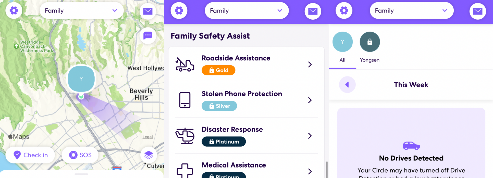
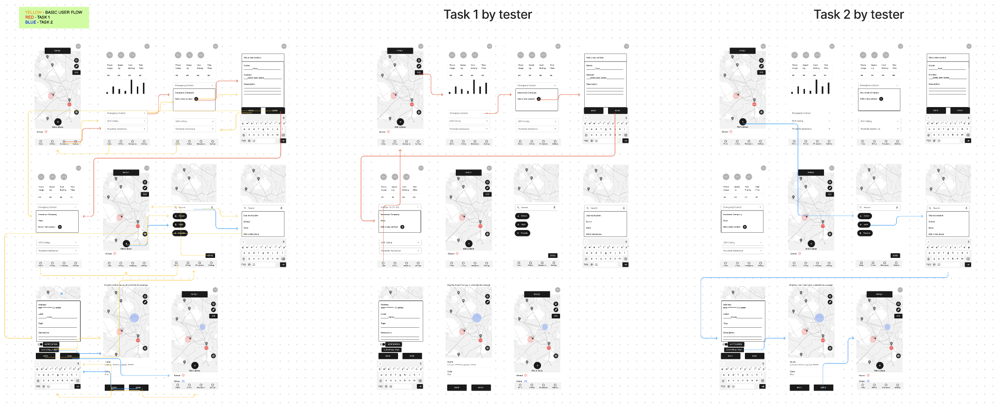
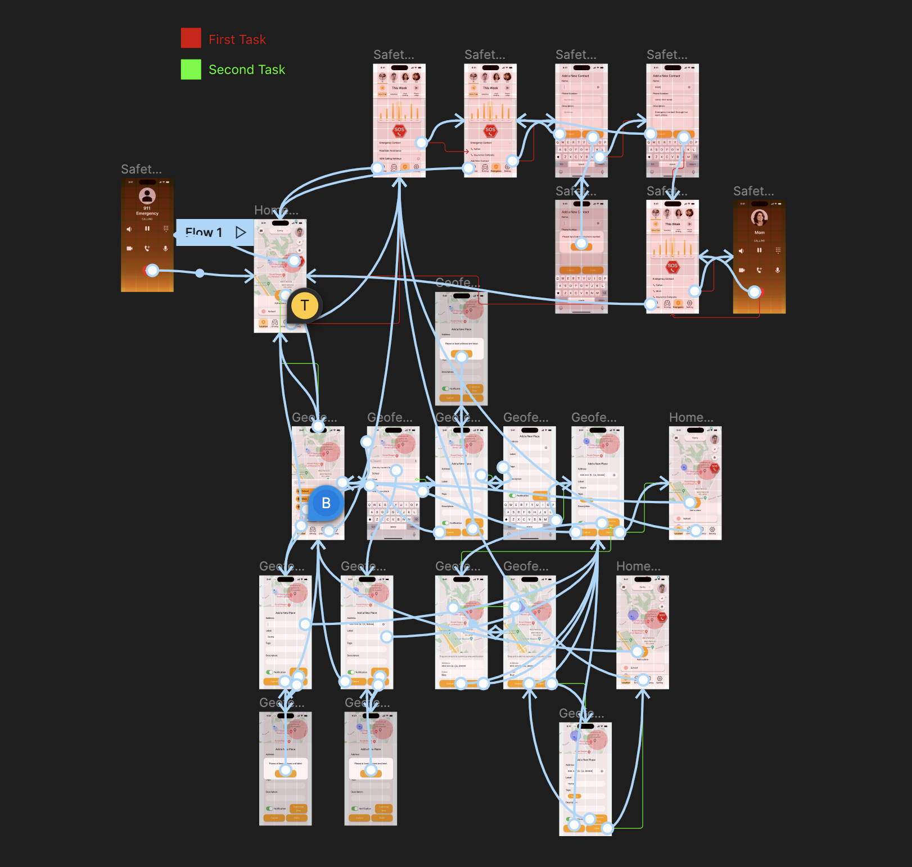

# TribeTrack
### DH 110 Project by Yongsen Huang

## Introduction
As I left home for college, I found myself lacking communication with my family. I often wondered where they were and what they were doing, and most importantly, if they had made it home safely. To address this issue, I decided to create an app that would allow me to connect with my family more easily.

TribeTrack is a driving safety app designed to help users track the location of their family members and monitor their driving habits to provide a sense of security and peace of mind. Its primary objective is to provide a seamless user experience through simple yet effective interactions and features that ensure the safety and well-being of family members.

## Clear Design Statement:

The app enables users to create customized geofences, share their location in real-time, and receive emergency assistance with just a click of a button. It also monitors driving habits, like phone usage while driving, speeding, and hard braking, and sends notifications to family members if any of these behaviors are detected. Another essential feature is that it allows users to set up SOS calling to 911, emergency calling to the most related people, and contact roadside support all within a single page.

TribeTrack's interface is designed to be clean, intuitive, and user-friendly, with a focus on providing all necessary information and features within a limited screen size. The app's layout grid is carefully designed to accommodate all features without becoming overwhelming or cluttered.

## Competitor analysis: Heuristic Evaluation

    

I conducted a heuristic analysis of the Life360 app to identify potential design flaws. I then compared the heuristic results with those of its competitor, Geozilla, and found that Life360 was the biggest competitor.

Overall, the Life360 app was found to have a very good heuristic evaluation. It excels in areas such as visibility of system status, match between system and the real world, user control and freedom, consistency and standards, and help and documentation. The app is well-designed, intuitive, and provides a range of useful features for families. However, there are some areas where the app could be improved, such as providing more customization options, warnings or prompts for potential errors, and interactive support options. Despite these areas for improvement, the app provides a solid user experience and is a valuable tool for families looking to stay connected and safe.

    <a href="https://mori-sam.github.io/dh110-sp23-assignment01/">Read More about the Heuristic Evaluation</a>

After conducting the heuristic analysis, I identified potential strengths and improvements in Life360's design. I then needed to corroborate these findings with actual user feedback.

## Competitor analysis: Usability Testing

To improve the Life360 app, a usability test is necessary to identify areas for improvement. The test will measure the app's effectiveness, efficiency, and satisfaction. Task 1 asks users to create and locate a new geofence, simulating the behavior of parent users. Task 2 tests the user's basic understanding of the app's features and invitation code by asking them to create and leave a new circle. Task 3 tests user control and freedom by simulating a situation where they need to cancel their Life360 membership subscription. All three tasks aim to identify and improve usability concerns regarding visibility, efficiency of use, and user control and freedom.

Following this pilot usability test, I gained insight into how a user would interact with the website and how I, as a UX researcher, should moderate a UX test.

    <a href="https://mori-sam.github.io/dh110_assignment02_yh/">Read More about the Usability Testing</a>

## User Research:

After identify potential improvements to Life360, I made the analysis of target users who use this type of app, and conducted an interview to whom he is qualify as a target user.

TribeTrack's primary target users are families or groups of friends who value privacy, accuracy, and ease of use. The app is suitable for all age groups and can be used for safety, coordination, and emergencies. To ensure accuracy, users need to enable GPS and ensure loved ones have the app installed and permission to share their location.

One observation I made is that people often compare location tracking apps based on their usability and available features. It is crucial to prioritize information security and provide a clear user interface. Additionally, location tracking apps tend to consume a significant amount of battery, which can inconvenience users. I learned a lot from my friend and obtained valuable feedback on how to improve the app's design.

Using these insights, I was ready to start thinking about potential users for my redesign.

    <a href="https://mori-sam.github.io/dh110_03_sp2023/">Read More about the User Research</a>

## UX Storytelling:

[![UXstory]](https://www.figma.com/file/35oSaNAcgXsAp27pYjtqUT/User-Persona-Template-(Community)?type=design&t=hloPaYuaEiIcqucd-6)

After studying potential users, I developed two personas:

- Sarah: Sarah is a busy working mother who wants to teach her children independence and safety. She uses a location tracking and driving safety app to keep track of her children's whereabouts and driving habits without being too intrusive. The app has given her peace of mind and helped her balance her desire for her children's freedom and safety.
- Max: Max, a high school student, is using a location tracking and driving safety app to alleviate his parents' worries about his inexperience as a new driver. The app provides feedback on his driving behavior and helps him improve his skills while balancing his desire for independence with safety concerns.

Next, I created empathy maps for each persona, as well as two scenarios related to these personas. These scenarios include what they say, do, think, and feel when encountering problems that can be solved by installing TribeTrack.

    <a href="https://mori-sam.github.io/dh110-sp2023-a04/">Read More about the UX Storytelling</a>

## Wireframe and Low-Fidelity Prototype:

[![Wireframe and Low-Fidelity Prototype]](https://www.figma.com/file/bXOugTmTdcLJkUJOAWC0Of/DH110-a05?type=whiteboard&t=hloPaYuaEiIcqucd-6)

Using my personas and scenarios and the three tasks in my pilot UT, I created a low-fidelity prototype of my proposed redesign.

The low fidelity prototype includes two tasks:

First task - Calling emergency assistance:

1. Set up new emergency contact
2. Add the number in the correct input
3. Complete setups
4. Find the correct page
5. Click on the emergency calling button

Second task - Set up geofence space:

1. Click the add place button
2. Insert place address
3. Customize by adding label and special notes
4. Customize by expanding or shrinking the geofence circle
5. Complete setup

Once I set up the low-fidelity prototype, I had my roommate test it to ensure that the interfaces and steps were clear to everyone.

    <a href="https://mori-sam.github.io/dh110-sp2023-a05lowfidelityprototype/">Read More about the Wireframe and Low-Fidelity Prototype</a>

## Graphic Design Element Variation:

    

The objective of the TribeTrack interface is to create a consistent and cohesive design language, integrating design elements such as font, shape, color, and layout to enhance the wireframe and improve the user experience. The app focuses on tracking family members, creating customized geofences, and providing emergency calling functionality, requiring more words and settings interactions than graphic interactions for a clear and concise user interface.

The final decision of the graphic design elements are orange color, SF Pro font type, and 4x9 layout.

    <a href="https://mori-sam.github.io/dh110_a06_sp2023/">Read More about the Graphic Design Element Variation</a>

## High-Fidelity Prototype and Final Design:

[![Final Design]](https://www.figma.com/file/LUVFanPDicMw6mCunnuDFt/High-Fidelity?type=design&node-id=0%3A1&t=oqqqK9hvjUNTpsGg-1)

During testing of the high-fidelity prototype of TribeTrack, the tester successfully completed two tasks: setting up an emergency call to their mom's phone number through the safety page and setting up a new geofence from the homepage by adding a new place and inputting it as their home address with ease.

    <a href="https://www.figma.com/file/LUVFanPDicMw6mCunnuDFt/High-Fidelity?type=design&node-id=0%3A1&t=oqqqK9hvjUNTpsGg-1">Click Here to Access the High-Fidelity Prototype</a>

    <a href="https://mori-sam.github.io/dh110-a7-highfidelity/">Read More about the High-Fidelity Prototype</a>

## Evaluation and Revision History:

[Low-Fidelity test](https://mori-sam.github.io/dh110-sp2023-a05lowfidelityprototype/6971683585449_.pic_hd.jpg)

> TribeTrack's SOS calling button needs to be more symbolic and easier to understand. The icons for existing geofences need to be clearer. Changing the "Done" button to "Save" will help users understand that they will return to the previous menu after saving geofence customization. Adding more shortcuts to features is a future goal.

[impression testing](https://ucla.zoom.us/rec/share/XAC87ajr2To0k33DwEg2JMwagfGeOcI7nAgOmNusEdP8-0R2cEQLVQyO0hBQiwfM.KS1QvEqbWpxEJs4f?startTime=1684198488000)

> In TribeTrack, the tester preferred SF Pro font due to its use in iOS, believed the bright orange color matched well with the SOS button, and preferred a corner radius of 30 degrees as it is more similar to the original design of iOS.

[Cognitive Walkthrough](https://ucla.zoom.us/rec/share/07O7Rt8ozPZWdr8QG_e2u9q2iv8v3CSKXaoE6S9YJ84xJW08-reCoJNTwLlXVZBU.FlWEaXXcA-AW9Qxv)

> During the cognitive walkthrough of TribeTrack, issues were discovered with the interaction design, specifically with dragging the geofence area circle. These issues were fixed, and the tester did not encounter any misdirections. The tester found the app's visibility to be good and was able to easily navigate back to previous frames and exit error prevention. The app's operations were found to be simple and easy to understand, and the tester had no suggestions for improvement. The interactive prototype for "Add New Contact" has been turned into a full interface, and interactions have been added to the "Add a new place" button. The menu bar has been linked to the Safety page, and a new frame has been added to make it easier to drag the geofence for the second task.

[New Cognitive Walkthrough](https://docs.google.com/document/d/12C1Y1SDM2Q5JXTp9KjsEScPwSwOfHDjaWI4Pu_XMyrg/edit)

> I received feedback from my classmates that helped me improve the usability and visibility of my project. While everyone understood the tasks and goals, there were some minor points of confusion. One issue was that the name "Safety" was not clear enough for users to understand that the page was for emergency calling. I changed the name to "Emergency". The SOS calling button on the homepage seemed to be associated with the geofence, so I made the drop shadow thicker. The SOS calling button on the "Emergency" page was not clearly identified as a calling button, so I added a phone sign below the SOS, similar to the one on the homepage.

## Conclusion:
Throughout the quarter of learning to become a UX designer, I enjoyed all the assignments. Initially, I thought the process would only involve designing websites and interfaces, but I was pleasantly surprised to discover that there was much more to it. In addition to designing, the course also covered important concepts such as user testing, interviews, and setting standards for a product. It was fascinating to learn that UX design requires a deep understanding of user needs and behavior, and that usability and accessibility are crucial aspects of any design.

As I delved deeper into the course, I also discovered that communication skills and the ability to work collaboratively with a team are essential for success in this field. I learned about User-based Evidence, which means understanding user experience by trying to position yourself as best you can inside the user's mind rather than speculating as to what users prefer. It is easy to project your own opinions and understanding of design onto users, but the designer is always biased.

During the training, I gained insights on designing graphical interface accessibility. One of the key principles I learned was to always bear in mind the color contrast and visibility for users with a 4.5:1 ratio. This is important to ensure that everyone, regardless of their visual capability, can have a seamless user experience.

Furthermore, I was able to acquire a wealth of experience by learning how to use Figma. This design software is a powerful tool that can help create stunning designs with ease. It has a myriad of features that can simplify the design process, such as a collaborative real-time design feature, which allows for seamless team collaboration. Additionally, it has a user-friendly interface, making it easy for beginners to learn and use. Overall, my experience with Figma was nothing short of amazing and I look forward to incorporating it into future projects.
